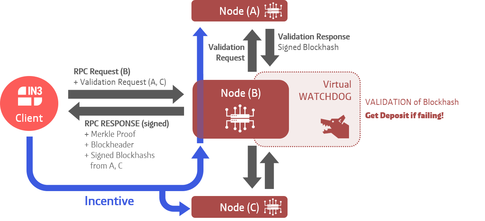

# INCUBED Client
 [](https://github.com/slockit/in3/forks)
 [](https://github.com/slockit/in3/watchers)
  [](https://github.com/slockit/in3/blob/master/LICENSE.AGPL)

INCUBED (in3) is a minimal verification client for blockchain networks. 

Most blockchains, such as Ethereum, require a client to connect to their blockchain network. Often, these clients 
require a very high bandwidth or constant computation. While this is possible to perform on laptops or desktop systems, 
mobile devices struggle to meet these requirements. Currently the solution of choice is to use a light client on mobile 
devices. While this works for mobile phones, most IoT devices are unable to run light clients. Connecting an IoT device 
to a remote node enables even low-performance IoT devices to be connected to blockchain. However, by using distinct 
remote nodes the advantages of a decentralized network are undermined introducing a single point of failure.
The Trustless Incentivized Remote Node Network, in short INCUBED, would make it possible to establish a 
decentralized and secure network of remote nodes, enabling trustworthy and fast access to blockchain for a large number 
of low-performance IoT and mobile devices.




A more detailed explanation of in3 can be found in the concept on [readthedocs](https://in3.readthedocs.io/en/develop/intro.html).


# Platforms

INCUBED can be used in different ways

| Stack                 | Size | Code Base | Use Case |
|-----------------------|------|-----------|----------|
| [TS/ JavaScript](#typescriptjavascript)        | 2.7MB  | https://github.com/slockit/in3 |   WebApplication (decentralized RPC-Client in the Browser) or Mobile Applications |
| [C/C++](#c---implementation)                 | 200kB| https://github.com/slockit/in3-c | IoT-Devices, can be integrated nicely on many micro controllers (like [zephyr-supported boards] (https://docs.zephyrproject.org/latest/boards/index.html) ) or anny other C/C++ -Application  |
| [Java](#java)                  | 705kB| https://github.com/slockit/in3-c    | Java-Implementation of a native-wrapper |
| [Docker](#docker)                | 2.6MB | https://github.com/slockit/in3 | For replacing existing clients with this docker and connect to incubed via localhost:8545 without the need to change the architecture |
| [bash](#commandline-tool)                  | 400kB | https://github.com/slockit/in3-c | the in3-commandline utils can be used directly as executable within bash-script or on the shell |

other Languages (like C#, Python, Go, Rust) will be supported soon (until then you can simply use the shared library directly).

For information on the in3-node, [sources on github](https://github.com/slockit/in3-server) or [readthedocs](https://in3.readthedocs.io/en/develop/api-node-server.html) will help you.

For information on the in3 client implementation in C, please go [in3-c](https://github.com/slockit/in3-c) or [API Documentation](https://in3.readthedocs.io/en/develop/api-c.html).

## Installation and Usage

[](https://www.npmjs.com/package/in3 )
 
Installing the in3-client is as easy as installing other modules:

```npm install --save in3 web3 @types/web3```

Import incubed with:

```import In3Client from "in3"```

## Example 
```
// import in3-Module
import In3Client from 'in3'
import Web3 from 'web3'

async function demo() {

    // use the In3Client as Http-Provider
    const web3 = new Web3(new In3Client({
        proof         : 'standard',
        signatureCount: 1,
        requestCount  : 2,
        chainId       : 'mainnet',
        replaceLatestBlock: 10
    }).createWeb3Provider())

    // use the web3
    const block = await web3.eth.getBlock('latest')
    console.log(`Incubed signed block hash ${block.hash}`)
}
...
}
```
Detailed examples with usage of in3 in typescript programs can be found [here](https://in3.readthedocs.io/en/develop/api-ts.html).

## Features

|                            | in3  | Remote Client | Light Client | 
| -------------------------- | :----------------: | :----------------: |  :----------------: |
| Failsafe connection        |         ✔️         |     ❌     |  ✔️ |
| Automatic Nodelist updates |         ✔️         |     ❌     |  ✔️ | 
| Partial nodelist           |         ✔️         |     ❌     |  ✔️ |
| Multi-chain support        |         ✔️         |      ✔️    |  ❌ |
| Full verification of JSON-RPC methods   |         ✔️         |  ❌  | ❌  |
| IPFS support               |         ✔️         |    ✔️    |  ❌ |
| Caching support            |         ✔️         |    ❌      |  ❌ |
| Proof-Levels               |         ✔️         |    ❌      |  ❌ |
| POA Support                |         ✔️         |    ✔️    |  ✔️   |
| Database setup size-minutes|        0-instant️   |    0-instant    |  ~50Mb-minutes️ |
| Uses                       |         IoT devices,Mobile,browser️ |    Mobile,browser️️    |  PC,Laptop️   |

## Resources 

* [TypeScript API reference](https://in3.readthedocs.io/en/develop/api-ts.html)
* [TypeScript examples](https://in3.readthedocs.io/en/develop/api-ts.html#examples)
* [in3-node](https://github.com/slockit/in3-server)
* [in3 C client](https://github.com/slockit/in3-c)
* [Website](https://slock.it/incubed/) 
* [ReadTheDocs](https://in3.readthedocs.io/en/develop/)
* [Blog](https://blog.slock.it/)
* [Incubed concept video by Christoph Jentzsch](https://www.youtube.com/watch?v=_vodQubed2A)
* [Ethereum verification explained by Simon Jentzsch](https://www.youtube.com/watch?v=wlUlypmt6Oo)

## Contributors welcome!

We at Slock.it believe in the power of the open source community. Feel free to open any issues you may come across, fork the repository and integrate in your own projects. You can reach us on various social media platforms for questions.  

[](https://twitter.com/slockitproject?s=17)
[](https://blog.slock.it/)
[](https://www.youtube.com/channel/UCPOrzp3CZmdb5HJWxSjv4Ig)
[](https://www.linkedin.com/company/10327305)
[](https://gitter.im/slockit-in3/community?utm_source=badge&utm_medium=badge&utm_campaign=pr-badge)

## Got any questions?
Contact us on [](https://gitter.im/slockit-in3/community?utm_source=badge&utm_medium=badge&utm_campaign=pr-badge) or
send us an email at <a href="mailto:team-in3@slock.it">team-in3@slock.it</a>


                                                                                                                                                                                                                                                                                                                                                                                                                                                                 